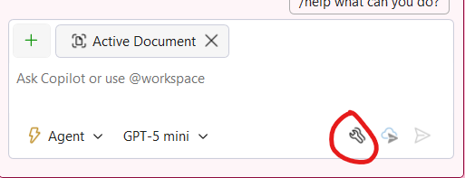

# Part 09: MCP Servers

Model Context Protocol (MCP) is an open protocol that standardizes how applications provide context to large language models (LLMs). MCP servers extend GitHub Copilot's capabilities by connecting to external tools and services, giving it access to real-time data and the ability to perform actions.

In this part, you'll learn how to add MCP servers to Visual Studio and use them to get information about optimizing your application.

## Adding MCP Servers from the Gallery

Visual Studio provides a gallery of pre-configured MCP servers that you can easily add to your project.

1. [] Open Visual Studio 2026 with the TinyShop solution.
1. [] Open the Copilot Chat window by clicking on the GitHub Copilot icon and selecting **Open Chat Window** or press `Ctrl+\+C`.
1. [] Click on the **Tools** icon at the bottom of the chat window to open the MCP server configuration.

   

1. [] Click on **Add MCP Server from Gallery**.
1. [] Search for **Microsoft Learn** and click **Add** to add it to your project.
1. [] Search for **GitHub** and click **Add** to add it to your project as well.
1. [] Both MCP servers should now appear in your tools list.

> [!TIP]
> MCP servers can provide access to documentation, APIs, and other services that can help Copilot give you more accurate and contextual responses.

## Using MCP Servers to Get Information

Now that you have the Microsoft Learn and GitHub MCP servers installed, let's use them to get information about optimizing asset loading in the application.

1. [] In Copilot Chat, switch to **Agent** mode.
1. [] Type the following prompt: `Using the Microsoft Learn documentation, what are the best practices for optimizing image loading and asset delivery in a Blazor Server application?`
1. [] Review the response from Copilot, which now has access to the latest Microsoft documentation through the MCP server.

## Creating GitHub Issues with MCP

The GitHub MCP server allows Copilot to interact with your GitHub repository. Let's use it to create issues for improvements we want to make to the application.

1. [] In the same chat session, type: `Based on the asset optimization recommendations, create 3 GitHub issues for improving the TinyShop application's performance. Include issues for image lazy loading, implementing a CDN strategy, and adding caching headers for static assets.`

   > [!NOTE]
   > Copilot will use the GitHub MCP server to create the issues directly in your repository. You may be prompted to authorize the action.

1. [] Review the issues that Copilot proposes to create.
1. [] Approve the creation of the issues when prompted.
1. [] Navigate to your GitHub repository to verify that the issues have been created.

**Key Takeaway**: MCP servers extend GitHub Copilot's capabilities by connecting it to external services and documentation. This allows Copilot to provide more accurate, up-to-date information and perform actions like creating GitHub issues directly from the chat interface.
