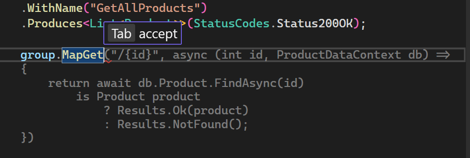
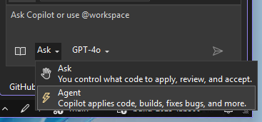

# Part 1: Code Completion with Ghost Text

In this section, you'll use GitHub Copilot's code completion to implement API endpoints.

> [!IMPORTANT]
> For this exercise, **DO NOT** copy and paste the code snippet provided, but rather type it manually. This will allow you to experience code completion as you would if you were coding back at your desk. You'll likely see you only have to type a few characters before GitHub Copilot begins suggesting the rest.

1. [] Open **ProductEndpoints.cs** in the **Products** project under **Endpoints** - it should be empty or contain minimal code.
2. [] Begin typing a comment to describe what you want to implement:
   ```csharp
   group.MapGet(
   ```
3. [] Wait for the ghost text suggestions to appear (gray text).

   

4. [] Press Tab to accept the suggestion or continue typing to get more specific suggestions.

5. [] From there Next Edit Suggetions (NES) or addtional Ghost Text suggestions will appear. 

   

6. [] We now can implement the following endpoints using GitHub Copilot:
   - GET product by ID
   - POST to create a new product
   - PUT to update a product
   - DELETE to remove a product

   - We can continue to use suggestions OR we could open GitHub Copilot Chat and work with Agent mode:
     - Open GitHub Copilot Chat in the top-right corner of Visual Studio and select **Open Chat Window** or press `Ctrl+\+C` if Copilot chat isn't open.
     - Switch to **Agent** mode.
     - ]
     - Ask the agent: `Can you implement the rest of the endpoints for the Product API and also implement the ProductService integration on the Store project?`

   The end code sould look similar to:

   ```csharp
   group.MapGet("/", async (ProductDataContext db) =>
   {
      return await db.Product.ToListAsync();
   })
   .WithName("GetAllProducts")
   .Produces<List<Product>>(StatusCodes.Status200OK);

   group.MapGet("/{id}", async  (int id, ProductDataContext db) =>
   {
      return await db.Product.AsNoTracking()
            .FirstOrDefaultAsync(model => model.Id == id)
            is Product model
               ? Results.Ok(model)
               : Results.NotFound();
   })
   .WithName("GetProductById")
   .Produces<Product>(StatusCodes.Status200OK)
   .Produces(StatusCodes.Status404NotFound);

   group.MapPut("/{id}", async  (int id, Product product, ProductDataContext db) =>
   {
      var affected = await db.Product
            .Where(model => model.Id == id)
            .ExecuteUpdateAsync(setters => setters
            .SetProperty(m => m.Id, product.Id)
            .SetProperty(m => m.Name, product.Name)
            .SetProperty(m => m.Description, product.Description)
            .SetProperty(m => m.Price, product.Price)
            .SetProperty(m => m.ImageUrl, product.ImageUrl)
            );

      return affected == 1 ? Results.Ok() : Results.NotFound();
   })
   .WithName("UpdateProduct")
   .Produces(StatusCodes.Status404NotFound)
   .Produces(StatusCodes.Status204NoContent);

   group.MapPost("/", async (Product product, ProductDataContext db) =>
   {
      db.Product.Add(product);
      await db.SaveChangesAsync();
      return Results.Created($"/api/Product/{product.Id}",product);
   })
   .WithName("CreateProduct")
   .Produces<Product>(StatusCodes.Status201Created);

   group.MapDelete("/{id}", async  (int id, ProductDataContext db) =>
   {
      var affected = await db.Product
            .Where(model => model.Id == id)
            .ExecuteDeleteAsync();

      return affected == 1 ? Results.Ok() : Results.NotFound();
   })
   .WithName("DeleteProduct")
   .Produces<Product>(StatusCodes.Status200OK)
   .Produces(StatusCodes.Status404NotFound);
   ```

   > [!IMPORTANT]
   >Because LLMs are probabilistic, not deterministic, the exact code generated can vary. The above is a representative example. If your code is different, that's just fine as long as it works!

7. [] Try changing the variable name of **id** to `productId` in the new **MapGet** method and see Next Edit Suggestions help out.

   

8. [] Try using documentation generation:
   - Type `///` above a method to generate XML documentation on the **MapProductEndpoints** this can also be brought up with `Alt+/` for inline and then entering **/** which will bring up a list of commands.

   

9. [] Test your implementation:
   - Run the AppHost project.
   - Test your new endpoints by going to **https://localhost:7130/api/Product/1**

**Key Takeaway**: GitHub Copilot can generate complete API implementations based on your comments or partial code, significantly speeding up development.
