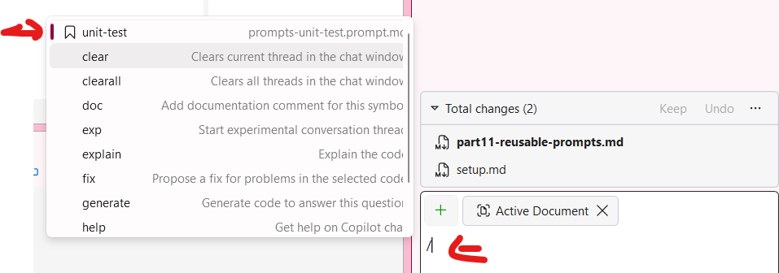

# Part 11: Reusable Prompt Files

Prompt files are a powerful way to create standardized, reusable prompts that can be shared across your team. They help ensure consistency in how you interact with GitHub Copilot and can encode best practices for common tasks like code generation, testing, and documentation.

In this part, you'll create a reusable prompt file for generating unit tests and use it to test the Product class in the TinyShop application.

## Understanding Prompt Files

Prompt files are markdown files stored in the `.github/prompts` folder of your repository. They:
- Can be invoked by name in Copilot Chat
- Are shared with your entire team through source control
- Can include placeholders for dynamic content
- Help standardize common development tasks

## Creating a Unit Test Prompt File

Let's create a prompt file that helps generate unit tests using MSTest.

1. [] In **Solution Explorer**, right-click on the solution and select **Add -> New Folder** and name it `.github` if it doesn't already exist.
1. [] Right-click on the `.github` folder and select **Add -> New Folder** and name it `prompts`.
1. [] Right-click on the `prompts` folder and select **Add -> New Item**.
1. [] Create a new file named `unit-test.prompt.md` with the following content:

   ```markdown
   ---
   mode: agent
   description: Generate comprehensive unit tests using MSTest
   ---

   # Unit Test Generator

   Generate unit tests for the selected code using the MSTest framework.

   ## Requirements

   - Use MSTest attributes ([TestClass], [TestMethod], [DataRow])
   - Follow the Arrange-Act-Assert pattern
   - Include both positive and negative test cases
   - Test edge cases and boundary conditions
   - Use descriptive test method names that explain what is being tested
   - Mock dependencies where appropriate

   ## Test Structure

   Each test should:
   1. Have a clear name following the pattern: `MethodName_Scenario_ExpectedBehavior`
   2. Include a brief comment explaining the test purpose
   3. Use proper assertions with meaningful failure messages

   ## Context

   Generate tests for: ${input:Describe what you want to test}
   ```

1. [] Save the file.

## Setting Up a Test Project

Before we can use our prompt, we need a test project. Let's create one using Copilot Agent.

1. [] Open Copilot Chat and switch to **Agent** mode.
1. [] Type: `Create a new MSTest project called TinyShop.Tests in the src folder and add it to the solution. Add a reference to the DataEntities project.`
1. [] Accept the changes proposed by Copilot.

## Using the Reusable Prompt

Now let's use our new prompt file to generate unit tests for the Product class.

1. [] In Copilot Chat, type `/` to see available prompt files.
1. [] Select `unit-test` from the list of available prompts.
1. [] When prompted for input, type: `the Product class in DataEntities, including tests for property getters/setters and validation of the Price property (should be non-negative)`

   

1. [] Review the generated tests. They should include:
   - Tests for each property
   - Tests for edge cases (empty strings, null values)
   - Tests for price validation
   - Proper test method naming

## Example Generated Tests

The generated tests should look similar to:

```csharp
using DataEntities;
using Microsoft.VisualStudio.TestTools.UnitTesting;

namespace TinyShop.Tests;

[TestClass]
public class ProductTests
{
    [TestMethod]
    public void Name_SetValue_ReturnsExpectedValue()
    {
        // Arrange
        var product = new Product();
        var expectedName = "Test Product";

        // Act
        product.Name = expectedName;

        // Assert
        Assert.AreEqual(expectedName, product.Name);
    }

    [TestMethod]
    public void Price_SetPositiveValue_ReturnsExpectedValue()
    {
        // Arrange
        var product = new Product();
        var expectedPrice = 29.99m;

        // Act
        product.Price = expectedPrice;

        // Assert
        Assert.AreEqual(expectedPrice, product.Price);
    }

    [TestMethod]
    [DataRow("product1.png")]
    [DataRow("product2.png")]
    [DataRow("")]
    public void ImageUrl_SetValue_ReturnsExpectedValue(string imageUrl)
    {
        // Arrange
        var product = new Product();

        // Act
        product.ImageUrl = imageUrl;

        // Assert
        Assert.AreEqual(imageUrl, product.ImageUrl);
    }
}
```

## Running the Tests

1. [] Open **Test Explorer** from **Test -> Test Explorer**.
1. [] Build the solution to discover the tests.
1. [] Click **Run All** to run the generated tests.
1. [] Verify that all tests pass.

**Key Takeaway**: Reusable prompt files help standardize how your team uses GitHub Copilot. By creating prompts for common tasks like unit testing, you ensure consistency and encode best practices that everyone on the team can benefit from.
