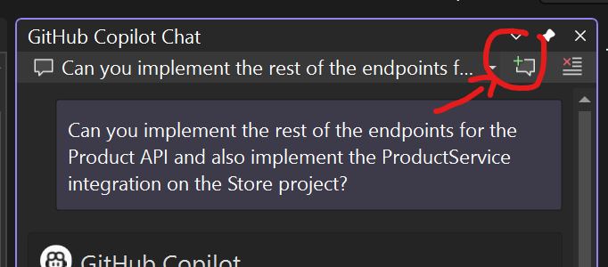

# Part 5: Implementing Features with Copilot Edits

Previously we utilized Copilot chat, which is great for working with an individual file or asking questions about our code. However, many updates necessitate changes to multiple files throughout a codebase. Even a seemingly basic change to a webpage likely requires updating HTML, CSS, Razor, and C# files. Copilot Edits allows you to modify multiple files at once.

With Copilot Edits, you will add the files which need to be updated to the context. Once you provide the prompt, Copilot Edits will begin the updates across all files in the context. It also has the ability to create new files or add files to the context as it deems appropriate.

Let's add the ability to see a list of images into the app:

1. [] In Visual Studio, open a new Copilot Edits chat with the **+** icon that has a pen editing a document or `Ctrl+Shift+N` with Copilot Chat in focus

    

2. [] If available, select **Claude 3.5 Sonnet** from the list of available models
3. [] Type: "Implement a product listing page in Products.razor that fetches products from #ProductService and displays them in a list with product name, description, price, and image."

    > [!NOTE]
    > You should use your own phrasing when generating the prompt. As highlighted previously, part of the exercise is to become comfortable creating prompts for GitHub Copilot. One key tip is it's always good to provide more guidance to ensure you get the code you are looking for.

    > [!NOTE]
    > If you are asked to **Enable Claude 3.5 Sonnet for all clients** click on **Enable** button.

Copilot begins generating the suggestions!

## Reviewing the suggestions

Unlike our prior examples where we worked with an individual file, we're now working with changes across multiple files - and maybe multiple sections of multiple files. Fortunately, Copilot Edits has functionality to help streamline this process.

GitHub Copilot will propose the following changes to the application including updating the Products.razor and adding a Products.razor.css and maybe more.

1. [] Review the suggestions and click "Accept All" to implement the code.

    The code should look similar to the following:
    ```html
    <table class="table">
        <thead>
            <tr>
                <th>Image</th>
                <th>Name</th>
                <th>Description</th>
                <th>Price</th>
            </tr>
        </thead>
        <tbody>
            @foreach (var product in products)
            {
                <tr>
                    <td></td>
                    <td>@product.Name</td>
                    <td>@product.Description</td>
                    <td>@product.Price</td>
                </tr>
            }
        </tbody>
    </table>
    ```

5. [] Run the application to see your new product listing page.

**Key Takeaway**: Copilot Edits can generate complete feature implementations based on your natural language descriptions, saving significant development time.
