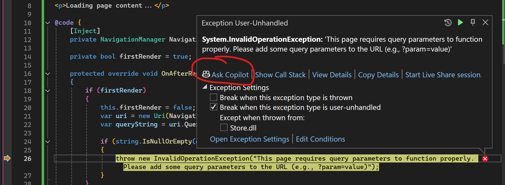

# Part 7: Debugging with Copilot

In this section, you'll learn how to use Copilot to debug an exception in your application.

1. Launch the web application.
2. Click on the **Go to About** button in the navigation menu.
3. Observe that an exception occurs, and the application crashes.
4. Press the **Ask Copilot** option in the pop up.

5. Review how Copilot brings in debugger information, including stack traces and variable states.
6. Note how Copilot recommends a fix for the issue or provides code suggestions to resolve it.
7. Implement the suggested fix and re-run the application to verify the issue is resolved.

**Key Takeaway**: Copilot can assist in diagnosing and fixing exceptions by analyzing debugger information and providing actionable recommendations.

## Using Watch Windows and Visualizers

In this subsection, you'll learn how to use Copilot to analyze variables using watch windows and visualizers.

1. [] Open the **Products.razor** file in your project.
2. [] Add a breakpoint at the end of the **OnInitializedAsync** method.
3. [] Launch the web application and navigate to the **Products** page.
4. [] When the breakpoint is hit, hover over the **imagePrefix** variable.
5. [] Press the **Copilot** button to analyze the **imagePrefix** variable.

    

    >Note: you can also see these in the Locals or watch windows

6. [] Observe how Copilot provides detailed information about the variable, including its value and potential issues.
7. [] Use the insights provided by Copilot to verify or debug the behavior of the **imagePrefix** variable.
8. [] Hover over the **products** collection and click the **View** button with the magnifier icon.

    

9. [] Use the visualizer to inspect the contents of the **products** collection.
10. [] Click the sparkle button and, in natural language, type:  
    *"Products that have the name outdoor in them and are under 10 dollars"*.  
    Observe how Copilot generates the appropriate expression automatically.

    

11. [] Click **Continue in Chat** to have Copilot provide the equivalent LINQ query for the same filter criteria.

**Key Takeaway**: Copilot can enhance debugging by providing detailed insights into variables through watch windows and visualizers. Copilot can simplify complex debugging tasks by generating expressions and LINQ queries based on natural language input.
