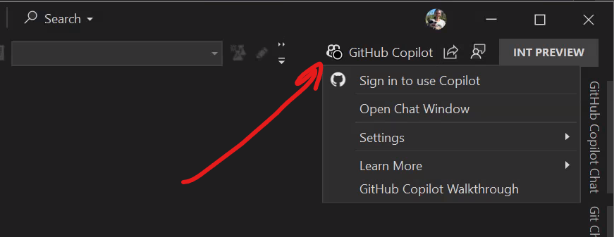

# Workshop setup

To complete this workshop you will need to clone a repository with a copy of the contents of this repository

> [!Hint]
> Under regular conditions you would need to ensure all prequirements, but don't worry. We have ensured this environment as all you need.

## Install GitHub Node Extension

Before we begin, let's install the GitHub Node extension for Visual Studio. This extension provides access to GitHub MCP servers which we will use later in the lab.

1. [] Open Visual Studio 2026
1. [] Go to **Extensions -> Manage Extensions**
1. [] Search for **GitHub Node** in the search box
1. [] Click **Install** on the **GitHub Node** extension by Mads Kristensen
1. [] Restart Visual Studio if prompted

> [!TIP]
> You can also install this extension from the [Visual Studio Marketplace](https://marketplace.visualstudio.com/items?itemName=MadsKristensen.GitHubNode). The GitHub Node extension is important because it provides the Node.js runtime required by some MCP servers, which you'll use in Part 9 of this lab.

## Configure GitHub Copilot - Skillable Lab

> [!IMPORTANT]
> For your convenience we have the username and password on the instructions, but you can also see their values in the Resources tab

These instructions are for the controlled Skillable lab environment used during the Build workshop.

1. [] Open **Edge** and go to `https://github.com/Microsoft-Build-2025`
1. [] Select **Continue** for Single sign-on to **Skillable Events**
1. [] Enter +++@lab.CloudPortalCredential(User1).Username+++ on the Email, phone, or Skype input box and click on **Next**
1. [] Enter +++@lab.CloudPortalCredential(User1).Password+++ on the password field and click on **Sign in**
1. [] Click on **Yes** when prompted to **Stay signed in**, you will be redirect to the main organization page, you can close the tab.
1. [] Open Visual Studio 2026
1. [] Select **Continue without code**, if prompted to sign-in, you can click Close.
1. [] Click on Copilot icon on top bar (left side next to the search input box)
    
1. [] Click on **Sign in to use Copilot** option
1. [] A browser will automatically open, you should already be signed in, click **Continue** for the signed in user.
1. [] Authorize Visual Studio access to user by clicking on the green **Authorize github** button at the bottom of the page.
1. [] Click **open** when the browser asks for the confirmation (**This site is trying to open Microsoft Visual Studio.**)
1. [] After Copilot is setup you should now have a **Walkthrough: GitHub Copilot Chat** open tab in Visual Studio and the GitHub Copilot button should be green.

You can close the Walkthrough, we are now ready to start working on our code with the help of Copilot.

## Configure GitHub Copilot - Personal Account

If you prefer to use your personal GitHub account instead of the Skillable lab account, follow these steps.

1. [] Open your browser and go to `https://github.com`.
1. [] Sign in with your personal GitHub account or create a new account if you don't have one.
1. [] Open Visual Studio 2026.
1. [] Select **Continue without code**, if prompted to sign-in, you can click Close.
1. [] Click the Copilot icon on the top bar (left side next to the search input box).
1. [] Click **Sign in to use Copilot**.
1. [] A browser window will open prompting you to sign in to GitHub and authorize Visual Studio and Copilot. Complete the sign-in and click **Authorize** when prompted.
1. [] When the browser shows the confirmation, click **open** to return to Visual Studio.
1. [] After setup you should see the **Walkthrough: GitHub Copilot Chat** tab and the Copilot button should be green.

    Note: Using your personal account is recommended if you want Copilot to access your own repositories, settings, and MCP authorizations. For the hands-on lab exercises that create or modify repository data via cloud agents, forking the lab repo into your own account gives the agents permission to operate on your fork.

## Clone lab repository

For the full experience — especially if you plan to delegate tasks to cloud agents or allow Copilot to create issues and push changes — fork the repository to your own GitHub account and clone your fork. This gives the cloud agent permissions to operate on your copy of the repo.

1. [] In your browser, go to `https://github.com/dotnet-presentations/build-2025-lab300` and click **Fork** to create a fork under your GitHub account.
1. [] In Visual Studio, click **File -> Clone Repository**.
1. [] Enter the URL of your fork (for example `https://github.com/<your-username>/build-2025-lab300`) and press **Clone**.

If you prefer not to fork you can still clone the upstream repository directly:

1. [] In Visual Studio, click **File -> Clone Repository**.
2. [] Enter `https://github.com/dotnet-presentations/build-2025-lab300` and press **Clone**.

The code is now opened in Visual Studio, feel free to take a look at it or skip to the next section to start the app.

## Start the app

1. [] Open the **Solution Explorer** from teh **View -> Solution Explorer** menu.
1. [] Set the **TinyShop.AppHost** as the startup project if it isn't by right clicking on the **TinyShop.AppHost** and selecting **Set as startup project**  and start the project with F5 or Debug -> Start Debugging from the menu.

    The .NET Aspire AppHost will start two applications and the .NET Aspire Dashboard:

    - The backend .NET app on **https://localhost:7130**. 
    - The frontend Blazor app on **http://localhost:7085**. You can see the app by opening that URL from the dashboard

1. [] Stop debugging and close the application.

## Summary and next steps

You've now cloned the repository you'll use for this for the rest of the workshop.

---

[Back: Part 12 - Delegate to the Cloud](./part12-delegate-to-cloud.md)
